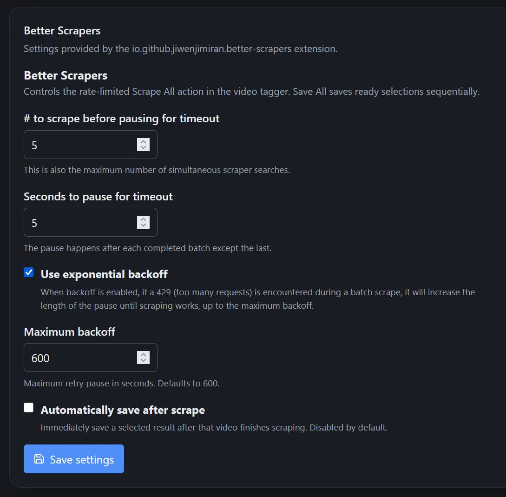

# Cove Better Scrapers

A Cove extension that improves the video tagger batch workflow:

- **Scrape All** processes videos in configurable batches, then pauses before continuing.
- **Save All** sequentially saves every currently selected scraper match.
- Both settings default to `5`: five simultaneous scrapes and a five-second pause between batches.

## Screenshots

### Video tagger controls


### Extension settings



## Install

Extract the release ZIP into:

```text
%LOCALAPPDATA%\cove\extensions\io.github.jiwenjimiran.better-scrapers
```

The folder must directly contain `extension.json`, `Cove.BetterScrapers.dll`, and `dist\bundle.js`. Restart Cove after installing or updating.

Configure the extension from Cove's **Extensions** settings tab. The controls appear only in the video tagger (`view=tagger`).

## Build

Requirements: .NET 9 SDK, Node.js 20+, and PowerShell 7/Windows PowerShell.

```powershell
npm --prefix frontend install
npm --prefix frontend test
npm --prefix frontend run build
dotnet build BetterScrapers.slnx -c Release
.\scripts\package.ps1
```

The package script creates `artifacts\io.github.jiwenjimiran.better-scrapers.zip`. Use `-Install` to also copy the extracted package into Cove's local extensions directory.

## How it works

Cove currently exposes no extension slot inside the tagger toolbar, so this extension attaches narrowly scoped controls to that existing toolbar at runtime. It leaves Cove's source files untouched and automatically detaches outside the video tagger.

## License

MIT
